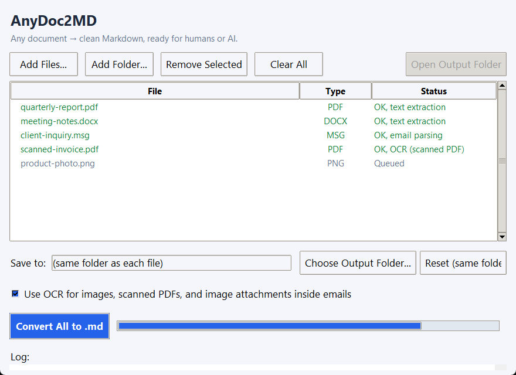

# AnyDoc2MD

**Any document → clean Markdown, ready for humans or AI.**

[](https://github.com/Mohamed-Syed/AnyDoc2MD/actions/workflows/ci.yml)
[](LICENSE)
[](https://www.python.org/downloads/)

A desktop GUI that batch-converts PDFs, Office documents, images, and emails
(`.eml` / `.msg`, attachments included) into Markdown — with OCR fallback for
scanned content, recursive conversion of email attachments (including
forwarded emails), and a fix for a common Arabic PDF text-extraction bug.

Built with the help of [Claude Code](https://claude.com/claude-code) — part
of an ongoing effort to grow my technical capabilities alongside AI tools.



## Features

- **Broad format support**: PDF, DOCX, PPTX, XLSX/XLS, HTML, CSV, JSON, TXT,
  images (PNG/JPG/GIF/BMP/TIFF), MP3/WAV, ZIP, and email (`.eml`, `.msg`).
- **OCR fallback**: scanned PDFs and image files are OCR'd automatically via
  Tesseract when the normal text layer comes back empty or missing.
- **Emails, properly**: `.eml`/`.msg` files are parsed for their headers and
  body (HTML bodies are converted to text, quoted reply/forward trails are
  trimmed to save tokens), and every attachment — including a forwarded email
  attached as its own `.msg`/`.eml` — is recursively converted through the
  same pipeline and appended as its own section.
- **Arabic PDF text-order fix**: many PDFs extract Arabic text in on-page
  visual (reversed) order with shaped presentation-form glyphs instead of
  logical reading order. AnyDoc2MD detects and corrects this for flowing
  paragraph text (see [Known limitations](#known-limitations) for where it
  doesn't apply).
- **Parallel conversion**: batches convert several files concurrently
  instead of one at a time.
- **Batch GUI**: add files or whole folders, pick an output location (or
  keep each `.md` next to its source), watch per-file status and a live log,
  and open the output folder when done.

## Installation

**Option A: standalone build (recommended for most users).** Download the
prebuilt `AnyDoc2MD` folder from [Releases](../../releases), unzip it, and
run `AnyDoc2MD.exe` inside. Nothing else to install — Tesseract OCR and
Poppler are bundled in (see [Standalone build](#standalone-build) below
for what exactly is bundled and why it's a large download).

**Option B: run from source.**

### 1. System dependencies (Windows)

```powershell
winget install UB-Mannheim.TesseractOCR
winget install oschwartz10612.Poppler
```

- **Tesseract OCR** powers image/scanned-PDF text recognition.
- **Poppler** renders PDF pages to images for the OCR fallback path.

If either is installed somewhere other than the default winget location,
update the paths in [`anydoc2md/config.py`](anydoc2md/config.py)
(`TESSERACT_EXE`, `POPPLER_BIN`).

### 2. Python dependencies

```powershell
pip install -r requirements.txt
```

## Usage

```powershell
python -m anydoc2md
```

or double-click `run_anydoc2md.bat` for a no-console launch (source
install only — the standalone build's own `AnyDoc2MD.exe` needs no
launcher).

1. **Add Files...** or **Add Folder...** to queue up documents.
2. Optionally choose an output folder (defaults to saving each `.md` next
   to its source file).
3. Leave **Use OCR** checked to handle scanned PDFs and images.
4. Click **Convert All to .md** — status and a live log update per file as
   conversions complete.

## Standalone build

`anydoc2md.spec` builds a self-contained `.exe` (via PyInstaller) that
needs nothing installed on the target machine — not even Python. It
bundles:

- The full Python runtime and all pip dependencies (~250-300 MB, driven
  mostly by `onnxruntime`, which is kept because MarkItDown uses it for
  ML-based file-type detection — dropping it would shrink the build
  substantially but make extension-less and mislabelled files fall back
  to guesswork).
- A **trimmed** copy of Tesseract OCR (~130 MB) and Poppler (~21 MB) —
  only the exact binaries and DLLs verified (via PE import-table
  analysis, not guesswork) to be needed at runtime; training tools, other
  language packs, and unrelated CLI utilities are left out. See
  [`THIRD_PARTY_NOTICES.md`](THIRD_PARTY_NOTICES.md) for exactly what's
  included and under what license (Tesseract: Apache 2.0, Poppler: GPL).

Total build size lands around 400-450 MB. That's the honest cost of
"works on a fresh machine with zero setup" — Tesseract's own OCR engine
(`libtesseract-5.dll`) alone is over 100 MB and can't be shrunk further
without recompiling Tesseract from source.

To build it yourself:

```powershell
pip install -r requirements.txt
pip install pyinstaller
python scripts/prepare_vendor.py    # stages a trimmed Tesseract+Poppler into vendor/
                                     # (requires the winget installs from Option B, step 1)
pyinstaller anydoc2md.spec --clean --noconfirm
```

The result is in `dist/AnyDoc2MD/`. It's built `--onedir` (not
`--onefile`): onefile re-extracts its entire payload to a temp folder on
*every* launch, which is a real, repeated performance cost at this size;
onedir launches instantly since nothing needs unpacking. Zip the whole
`dist/AnyDoc2MD/` folder for distribution.

UPX compression was deliberately not used — it can trigger antivirus
false positives (packing is also a common malware technique), a bad
tradeoff for a tool meant to be freely downloaded and run by strangers.

## How it works

The package is organized by concern under `anydoc2md/`:

| Module | Responsibility |
|---|---|
| `converter.py` | Top-level dispatch: routes each file to the right conversion path by extension. |
| `email_convert.py` | Parses `.eml`/`.msg`, extracts attachments, recurses them back through `converter.py`. |
| `ocr.py` | Tesseract/Poppler-backed OCR for images and scanned PDFs. |
| `arabic.py` | The Arabic PDF text-order fix. |
| `text_utils.py` | Shared string-cleaning helpers (filename sanitizing, HTML-to-text, control-character stripping). |
| `safety.py` | Guards against maliciously crafted input (see [Security](#security) below). |
| `gui.py` | The Tkinter application. |

Batch conversion runs on a background thread with a `ThreadPoolExecutor`
pool (bounded to your CPU count, max 8) so multiple files convert at once;
each pool thread gets its own `MarkItDown` instance rather than sharing one
across threads.

## Security

This tool's entire purpose is processing files that may come from an
untrusted source — an email attachment, a downloaded zip — so it includes
guards against maliciously crafted input, not just malformed input. Each
guard below has regression tests in `tests/`; see
[SECURITY.md](SECURITY.md) for the threat model these come from and how
to report a vulnerability.

- **Email nesting depth cap** (`MAX_EMAIL_NESTING_DEPTH`, default 10): a
  forwarded email containing a forwarded email containing a forwarded
  email... has no natural bound. Without a cap, a crafted `.msg`/`.eml`
  could force unbounded recursive processing. Past the cap, the
  conversion stops cleanly with a note in the output rather than
  recursing further.
- **Zip decompression-bomb guard** (`safety.py`): the `markitdown` library
  we build on decompresses every entry of a `.zip` with no size or
  entry-count limit, and recurses into nested zips the same way — a
  classic decompression-bomb shape. Before handing a `.zip` to
  `markitdown`, we check its central-directory metadata (total declared
  uncompressed size, entry count, and — recursively, up to a depth of 3 —
  the same for any zip nested inside it) and refuse to convert it if
  those exceed sane limits (300 MB uncompressed / 2,000 entries by
  default). The archive is opened by path and only its metadata is read,
  so a multi-gigabyte input is never buffered into memory before the
  check runs; descending into a nested zip is the one place data must be
  decompressed, and that read stops at the size limit rather than
  trusting the declared entry size — which closes the gap a deliberately
  understated header would otherwise open.
- **Bounded OCR rasterization**: a PDF may declare unlimited pages and
  arbitrarily large page dimensions, and rendering at 300 dpi is the most
  expensive thing this tool does — a single crafted page could ask for a
  multi-gigapixel bitmap. Page count is checked (via Poppler's metadata)
  before anything is rendered, and Pillow's decompression-bomb ceiling is
  pinned explicitly rather than left to vary with the installed version
  (`MAX_OCR_PDF_PAGES`, `MAX_OCR_IMAGE_PIXELS`).
- **Attachment caps**: a single `.eml` can declare unlimited attachments,
  each of which gets written to disk and recursively converted. Both the
  count and the aggregate size are bounded.
- **Path traversal**: attachment filenames from parsed emails are reduced
  to a bare basename before any filesystem use, so a crafted `../../`
  filename can't escape the temp directory it's extracted into.
  Separators from *both* platforms are stripped (not just the host's),
  Windows reserved device names (`CON`, `NUL`, `COM1`…) are renamed so
  they can't be opened as devices, and over-long names are truncated
  below the 255-character path-component limit.
- **No local paths in output**: converted `.md` files are meant to be
  shared and fed to LLMs, so error text embedded in them — and in the GUI
  log that users paste into bug reports — is stripped of directory
  components first. A failed attachment reports `invoice.pdf`, never the
  temp path that would carry your username and folder layout.
- **No shell/subprocess injection risk**: this project makes no
  `shell=True` calls anywhere. Its one direct process launch — opening the
  finished output folder in the OS file manager (`explorer` / `open` /
  `xdg-open`) — is handed an argument list containing a directory the app
  itself created, never anything derived from document content. The two
  dependencies that shell out (`pytesseract`, `pdf2image`) invoke
  Tesseract/Poppler with argument lists (never `shell=True`), and every
  path this project passes to them is an absolute path built via
  `os.path.join`/`tempfile.mkdtemp` — never a bare, attacker-controlled
  string that could be misread as a command-line flag.

## Built on

Non-email/non-image document parsing is powered by Microsoft's
[MarkItDown](https://github.com/microsoft/markitdown) library. AnyDoc2MD is
an independent, unofficial GUI/pipeline built on top of it (and other
libraries listed in `requirements.txt`) — it is not affiliated with or
endorsed by Microsoft.

## Known limitations

- **Only English OCR** is installed by default. Add other Tesseract
  language packs (`tesseract-ocr-<lang>` via your package manager, or the
  relevant `.traineddata` file) for other languages.
- **Very long documents are OCR'd only in part.** The OCR fallback stops
  after `MAX_OCR_PDF_PAGES` (200) pages and says so in the output; raise
  it in `config.py` if you routinely convert longer scans.
- **The 20-character "is this PDF scanned" heuristic** can occasionally
  trigger OCR on a PDF with a real but very sparse text layer. Harmless,
  just slower.
- **No image preprocessing** (deskew, contrast enhancement) is applied
  before OCR, so quality depends on the source image/scan quality.
- **The Arabic text-order fix is a targeted heuristic, not a full Unicode
  Bidirectional Algorithm implementation.** It reliably fixes flowing
  paragraph text, but PDF **table cells** can cluster glyphs differently at
  the font/extraction level — confirmed on a real-world PDF where the same
  "reverse the run" logic that fixes paragraph text does not correctly
  reorder a table-cell label. The English content in the same table is
  unaffected; only Arabic *labels specifically inside PDF tables* should be
  treated with caution.
- **OneNote (`.one`) is not supported.** It's a proprietary binary format
  with no reliable open-source parser; export OneNote pages to PDF or Word
  first if you need to convert them.

## Development

```powershell
pip install -r requirements-dev.txt
python -m pytest        # unit tests
ruff check .            # lint
```

The test suite covers the pure-logic modules — every security control in
`safety.py`, filename sanitizing and path redaction in `text_utils.py`,
the Arabic reordering heuristic, email parsing, and conversion dispatch.
The Tkinter GUI is deliberately not automated (it proved fragile and
unreliable); for end-to-end checks, call
`anydoc2md.converter.convert_one(path, use_ocr)` directly against a real
file — that's the same entrypoint the GUI uses.

CI runs the suite on Windows and Linux. Please don't attach real
personal or confidential documents to issues; a small synthetic file that
reproduces the problem is more useful anyway.

## Reporting a vulnerability

Please report security issues privately — see [SECURITY.md](SECURITY.md),
which also documents the threat model and its known residual limitations.

## License

AnyDoc2MD's own source code is **MIT** — see [LICENSE](LICENSE).

**The prebuilt `.exe` is a combined work under the GPL v3**, because it
bundles `extract-msg` (GPL-3.0, used for Outlook `.msg` parsing) and
Poppler (GPL-2.0-or-later). This does not affect reusing AnyDoc2MD's own
code under MIT, and it does not affect running from source for your own
use. See [THIRD_PARTY_NOTICES.md](THIRD_PARTY_NOTICES.md) for the full
breakdown, the written offer for source, and how to build without the
copyleft dependency.
